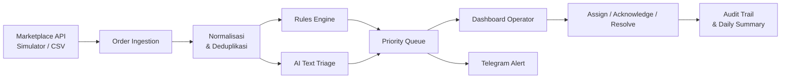
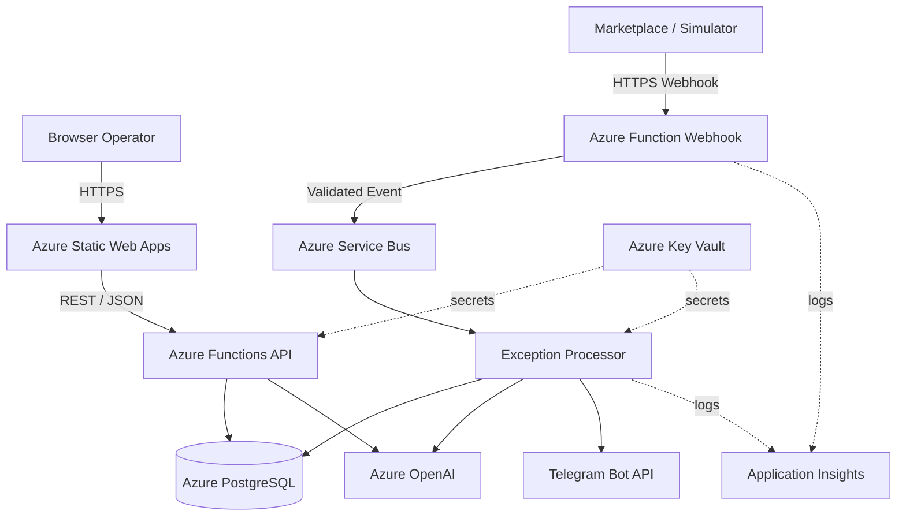

# FlowOps

> Tahu order yang bermasalah sebelum terlambat.

FlowOps adalah aplikasi web berbasis cloud yang membantu seller online menemukan dan menangani pesanan bermasalah atau mendekati tenggat. Alih-alih hanya menampilkan semua order, FlowOps menyaring event operasional menjadi antrean tindakan yang singkat, terurut, dan dapat dijelaskan.

Status proyek: **planning / pre-development**. README ini merupakan spesifikasi awal; fitur yang dijelaskan belum dianggap tersedia sampai implementasi dan pengujiannya selesai.

## Latar Belakang

Operasional seller online dapat tersebar di marketplace, pesan instan, dashboard logistik, dan catatan internal. Order normal bercampur dengan order yang perlu segera ditangani, misalnya:

- pesanan mendekati batas *ready to ship*;
- resi atau label pengiriman belum tersedia;
- jumlah pesanan tidak sesuai dengan stok tercatat;
- permintaan pembatalan perlu ditinjau;
- status pengiriman tidak berubah terlalu lama;
- alasan komplain atau retur harus dibaca satu per satu.

BPS memperkirakan terdapat 3.816.750 usaha e-commerce di Indonesia pada 2023. Sebanyak 95,33% menggunakan pesan instan sebagai media penjualan, sedangkan hanya 15,19% yang memiliki laporan keuangan. Data tersebut tidak membuktikan bahwa seluruh seller mengalami order terlewat, tetapi menunjukkan besarnya segmen usaha digital yang membutuhkan alat operasional sederhana.

Marketplace juga menerapkan SLA pemrosesan. Dokumentasi TikTok Shop menjelaskan bahwa order yang tidak mencapai status tertentu sebelum `rts_sla`, `tts_sla`, atau `cancel_order_sla` dapat dinilai terlambat atau dibatalkan otomatis.

FlowOps dirancang untuk menjawab satu pertanyaan:

> **Order mana yang bermasalah, mengapa order tersebut diprioritaskan, dan apa yang harus dilakukan sekarang?**

## Target Pengguna

Pengguna awal FlowOps adalah pemilik dan tim operasional toko online kecil–menengah yang:

- mengelola order marketplace dengan tim kecil;
- memiliki pembagian tugas antara owner, admin, customer service, atau fulfillment;
- mulai kesulitan memantau order secara manual;
- belum membutuhkan ERP omnichannel yang besar.

Target pengguna tersebut masih berupa hipotesis awal dan perlu divalidasi melalui pengujian prototipe.

## Solusi

FlowOps menerima event order dari marketplace, simulator, atau CSV. Data kemudian dinormalisasi, diperiksa dengan aturan operasional, dan dimasukkan ke antrean apabila ditemukan masalah. Operator dapat melihat alasan prioritas, mengambil tugas, memberi catatan, dan menandai masalah sebagai selesai.

AI hanya digunakan untuk data yang tidak terstruktur, seperti alasan komplain atau retur dan ringkasan operasional. Tenggat, status order, deduplikasi, dan otorisasi tetap ditangani dengan aturan deterministik agar hasilnya konsisten dan mudah diuji.



## Fitur MVP

### 1. Order Ingestion

- menerima webhook HTTPS dari marketplace simulator;
- menerima impor CSV sebagai jalur cadangan;
- memvalidasi dan menormalisasi payload;
- mencegah event yang sama diproses dua kali menggunakan `event_id`.

### 2. Exception Detection

Lima exception awal:

| Kode | Kondisi | Metode Deteksi |
|---|---|---|
| `SLA_RISK` | Batas pemrosesan semakin dekat | Aturan waktu |
| `TRACKING_MISSING` | Resi atau label belum tersedia | Status dan batas waktu internal |
| `STOCK_MISMATCH` | Kuantitas order melebihi stok tercatat | Perbandingan data |
| `CANCEL_REVIEW` | Permintaan pembatalan perlu ditinjau | Event status dan analisis alasan |
| `DELIVERY_STALLED` | Status pengiriman tidak berubah terlalu lama | Durasi sejak update terakhir |

### 3. Action Queue

- menampilkan exception aktif berdasarkan urgensi;
- filter berdasarkan tipe, severity, status, dan operator;
- memperlihatkan alasan sebuah order diprioritaskan;
- mendukung alur `open` → `acknowledged` → `resolved`.

### 4. Operator Collaboration

- role owner dan operator;
- assign exception kepada anggota tim;
- catatan tindakan dan timeline order;
- audit trail untuk setiap perubahan.

### 5. Notification

- notifikasi Telegram untuk exception prioritas tinggi;
- isi alert mencakup order, alasan, waktu tersisa, dan tautan dashboard;
- deduplikasi dan cooldown untuk menghindari alert berulang.

### 6. AI Text Triage

AI mengubah alasan komplain atau retur menjadi output terstruktur:

```json
{
  "category": "damaged_item",
  "urgency": "high",
  "summary": "Produk diterima dalam kondisi pecah",
  "suggested_action": "Minta bukti foto dan periksa kebijakan penggantian",
  "confidence": 0.88
}
```

Kategori awal:

- `damaged_item`
- `wrong_item`
- `late_delivery`
- `change_address`
- `buyer_changed_mind`
- `other`

AI juga dapat membuat ringkasan harian mengenai jumlah exception, masalah dominan, pekerjaan yang belum selesai, dan rekomendasi operasional.

## Novelty

FlowOps tidak mengklaim sebagai aplikasi pertama yang memakai AI atau mengelola marketplace. Kebaruan produk berada pada kombinasi berikut:

1. **Exception-first** — halaman utama menampilkan pekerjaan yang perlu ditangani, bukan seluruh data bisnis.
2. **Explainable priority** — setiap prioritas memiliki rule, deadline, dan alasan yang terlihat.
3. **Hybrid rules + AI** — aturan pasti digunakan untuk SLA, sedangkan AI digunakan untuk teks ambigu.
4. **Human-in-the-loop** — AI memberikan konteks dan saran, tetapi keputusan penting tetap dilakukan operator.
5. **Demo-resilient** — simulator memungkinkan seluruh alur jaringan, cloud, retry, dan AI didemonstrasikan tanpa bergantung pada approval API eksternal.

## Scope

### Wajib untuk MVP

- aplikasi web responsif;
- marketplace simulator dan impor CSV;
- lima exception rules;
- priority queue dan detail order;
- assign, acknowledge, resolve, dan audit trail;
- Telegram alert;
- AI triage dan ringkasan harian;
- deployment di Microsoft Azure.

### Fitur Tambahan

- integrasi satu marketplace nyata apabila akses API tersedia;
- feedback terhadap hasil klasifikasi AI;
- dashboard metrik operasional.

### Tidak Termasuk MVP

- integrasi seluruh marketplace;
- WhatsApp Business API;
- sinkronisasi inventory penuh;
- auto-fulfillment, pembatalan, atau refund tanpa persetujuan manusia;
- aplikasi mobile native;
- billing dan multi-tenant skala produksi.

## Arsitektur Sistem



Queue memisahkan penerimaan webhook dari pemrosesan exception. Dengan demikian, endpoint dapat merespons cepat sementara event diproses secara asinkron. Setiap event memiliki idempotency key untuk mencegah duplikasi ketika sumber melakukan retry.

## Rencana Technology Stack

| Area | Teknologi |
|---|---|
| Frontend | React, TypeScript, Vite |
| UI | Tailwind CSS atau component library yang disepakati tim |
| Hosting frontend | Azure Static Web Apps |
| Backend | TypeScript dan Azure Functions |
| API | REST, JSON, HTTPS, webhook |
| Queue | Azure Service Bus |
| Database | Azure Database for PostgreSQL |
| AI | Azure OpenAI / Microsoft Foundry |
| Notification | Telegram Bot API |
| Secrets | Azure Key Vault |
| Monitoring | Azure Application Insights |
| CI/CD | GitHub Actions |

Stack masih dapat disesuaikan sebelum implementasi dimulai. Perubahan harus tetap mempertahankan tiga aspek utama proyek: jaringan komputer, komputasi awan, dan kecerdasan buatan.

## Implementasi Modul

### Jaringan Komputer

- arsitektur client–server;
- DNS dan HTTPS/TLS;
- REST API dan webhook HTTP POST;
- pertukaran data JSON;
- token, autentikasi, dan validasi signature;
- timeout, retry, idempotency, dan komunikasi asinkron.

### Komputasi Awan

- hosting frontend dan API di Azure;
- message queue untuk pemrosesan event;
- database terkelola;
- secret management;
- logging dan monitoring terpusat;
- deployment otomatis melalui GitHub Actions.

### Kecerdasan Buatan

- klasifikasi teks komplain/retur;
- structured output menggunakan JSON Schema;
- rekomendasi tindakan yang harus ditinjau operator;
- ringkasan operasional harian;
- evaluasi menggunakan dataset berlabel dan koreksi pengguna.

## AI Guardrails

- AI tidak dapat membatalkan order atau menyetujui refund secara otomatis.
- Output AI harus lolos validasi schema.
- Confidence rendah menghasilkan status `needs_review`.
- Secret dan token integrasi tidak dikirim ke model.
- Data customer diminimalkan atau disamarkan sebelum diproses.
- Hasil AI dan koreksi operator dicatat untuk evaluasi.

## Model Data Awal

| Entitas | Fungsi |
|---|---|
| `organizations` | Menyimpan identitas toko/organisasi |
| `users` | Menyimpan owner dan operator |
| `orders` | Menyimpan order yang telah dinormalisasi |
| `order_items` | Menyimpan item dan SKU dalam order |
| `events` | Menyimpan event mentah, hash, dan waktu penerimaan |
| `exceptions` | Menyimpan masalah, severity, priority, dan assignee |
| `ai_analyses` | Menyimpan input hash, model, kategori, dan output AI |
| `actions` | Menyimpan tindakan operator dan audit trail |
| `notifications` | Menyimpan status pengiriman notifikasi |

## Key Metrics

1. **SLA-safe resolution rate:** persentase exception prioritas tinggi yang diselesaikan sebelum tenggat.
2. **Median time-to-acknowledge:** waktu dari exception terdeteksi sampai diambil operator.
3. **Weekly active stores:** jumlah toko yang menangani minimal satu exception setiap minggu.

Metrik teknis seperti reliabilitas webhook, duplikasi event, latency, dan akurasi AI akan diukur dalam pengujian, tetapi dipisahkan dari metrik nilai produk.

## Kriteria Keberhasilan MVP

| Area | Target Awal |
|---|---:|
| Event uji berhasil diterima dan disimpan | ≥ 99% |
| Record ganda pada pengujian retry | 0 |
| Median event-to-exception pada demo | < 5 detik |
| Akurasi lima rule pada test case | 100% |
| Macro-F1 klasifikasi AI | ≥ 0,75 |
| Output AI sesuai schema | ≥ 95% |
| Exception memiliki alasan dan action suggestion | 100% |

Target tersebut merupakan sasaran eksperimen, bukan klaim performa produk yang sudah tercapai.

## Rencana Pengembangan

1. **Discovery & design** — finalisasi user flow, wireframe, data contract, dan backlog.
2. **Foundation** — setup monorepo, CI/CD, autentikasi, database, dan simulator.
3. **Exception engine** — normalisasi, deduplikasi, rules, dan priority score.
4. **Operator workflow** — dashboard, detail, assign, resolve, dan audit trail.
5. **AI & notification** — text triage, evaluation set, Telegram, dan daily summary.
6. **Hardening** — security, retry, observability, dan usability testing.
7. **Optional integration** — satu marketplace API nyata apabila akses tersedia.
8. **Demo & documentation** — seed data, skenario demo, panduan, dan deployment final.

## Skenario Demo

1. Simulator mengirim enam order normal dan empat order bermasalah.
2. Satu webhook dikirim ulang untuk membuktikan idempotency.
3. Dashboard menampilkan empat exception berdasarkan urgensi.
4. Telegram menerima alert untuk order berisiko tinggi.
5. AI mengklasifikasikan alasan retur berbahasa Indonesia.
6. Operator mengoreksi satu hasil AI, mengambil tugas, dan menyelesaikannya.
7. Owner membuka audit trail, metrik, dan ringkasan harian.

## Risiko Utama

| Risiko | Mitigasi |
|---|---|
| Approval API marketplace terlambat | Simulator dan CSV menjadi jalur MVP resmi |
| Scope berubah menjadi ERP besar | Batasi pada lima exception dan satu action queue |
| AI salah mengklasifikasikan teks | Schema, threshold, evaluasi, dan human review |
| Notifikasi terlalu banyak | Severity threshold, cooldown, dan deduplikasi |
| Event hilang atau diproses ganda | Durable queue, retry, idempotency, dan audit log |
| Data customer sensitif | Data minimization, RBAC, encryption, dan Key Vault |

## Referensi

- [BPS — Statistik E-Commerce 2023](https://www.bps.go.id/id/publication/2025/01/30/d52af11843aee401403ecfa6/statistik-e-commerce-2023.html)
- [Bank Indonesia — UMKM dan Digitalisasi](https://www.bi.go.id/id/publikasi/ruang-media/cerita-bi/Pages/Sinergi-Jadi-Energi-Saat-UMKM-Naik-Kelas-Lewat-Digitalisasi.aspx)
- [TikTok Shop — Orders API Overview](https://partner.tiktokshop.com/docv2/page/650b1b4bbace3e02b76d1011)
- [TikTok Shop — Return, Refund, and Cancel API](https://partner.tiktokshop.com/docv2/page/return-refund-and-cancel-api-overview)
- [Azure Static Web Apps](https://learn.microsoft.com/en-us/azure/static-web-apps/overview)
- [Azure Functions HTTP Trigger](https://learn.microsoft.com/en-us/azure/azure-functions/functions-bindings-http-webhook-trigger)
- [Azure Service Bus](https://learn.microsoft.com/en-us/azure/service-bus-messaging/service-bus-queues-topics-subscriptions)
- [Structured Outputs with Azure OpenAI](https://learn.microsoft.com/en-us/azure/ai-services/openai/how-to/structured-outputs)

## License

Lisensi proyek belum ditentukan.

