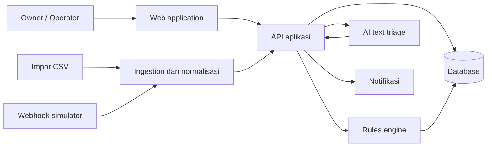

# Arsitektur FlowOps

## Gambaran umum

Arsitektur FlowOps memisahkan penerimaan data, aturan exception, akses pengguna, dan rekomendasi AI. Pemisahan ini membuat tenggat serta prioritas dapat diuji dan dijelaskan tanpa bergantung pada output AI.

## Komponen

| Komponen | Tanggung jawab |
| --- | --- |
| Web application | Halaman login, antrean exception, detail order, impor CSV, dan pengaturan. |
| API aplikasi | Autentikasi, otorisasi, validasi input, endpoint order/exception, serta pencatatan audit. |
| Ingestion dan normalisasi | Menerima CSV atau webhook simulator, memeriksa data, mencegah duplikasi event, lalu mengubahnya menjadi model order internal. |
| Database | Menyimpan pengguna, order, event, exception, penugasan, tindakan, dan audit trail. |
| Rules engine | Menjalankan aturan EX-01 sampai EX-05, menghitung urgensi, serta menyimpan alasan rule yang terpicu. |
| AI text triage | Mengubah teks komplain atau retur menjadi ringkasan dan saran terstruktur; hasilnya tidak boleh mengubah status kritis otomatis. |
| Notifikasi | Memberi pemberitahuan untuk exception prioritas tinggi kepada pihak yang relevan. |

## Alur data

1. Owner atau sistem mengirim data order dari CSV atau webhook simulator.
2. Ingestion memvalidasi payload, memeriksa event duplikat, dan menormalisasi data ke format internal.
3. Data order dan event disimpan ke database.
4. Rules engine mengevaluasi data dan membuat atau memperbarui exception beserta alasan prioritasnya.
5. Bila terdapat teks komplain/retur, AI triage membuat rekomendasi terstruktur yang dapat dikoreksi operator.
6. Operator menangani exception yang ditugaskan kepadanya; perubahan status dan tindakan masuk ke audit trail.
7. Owner memantau seluruh antrean, penugasan, dan riwayat tindakan.

## Batas akses

| Aksi | Owner | Operator |
| --- | --- | --- |
| Melihat seluruh order dan exception | Ya | Tidak |
| Melihat order yang ditugaskan | Ya | Ya |
| Menugaskan operator | Ya | Tidak |
| Mengubah status penanganan tugas sendiri | Ya | Ya |
| Meninjau audit trail | Ya | Terbatas pada order yang dapat diakses |

## Prinsip implementasi

- Semua endpoint memeriksa identitas pengguna dan role sebelum membaca atau mengubah data.
- Setiap sumber event memiliki kunci idempotensi agar pengiriman ulang tidak membuat data ganda.
- Rules engine bersifat deterministik; input dan hasilnya dapat diuji dari data contoh.
- AI menerima data minimum yang diperlukan dan keluarannya divalidasi sebelum ditampilkan.
